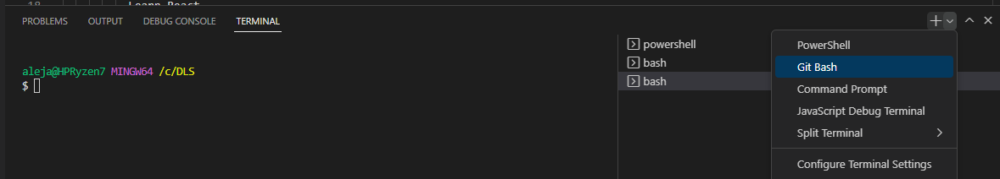
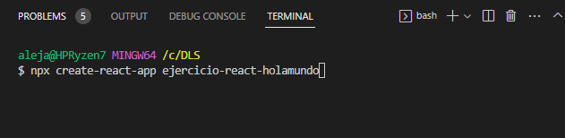
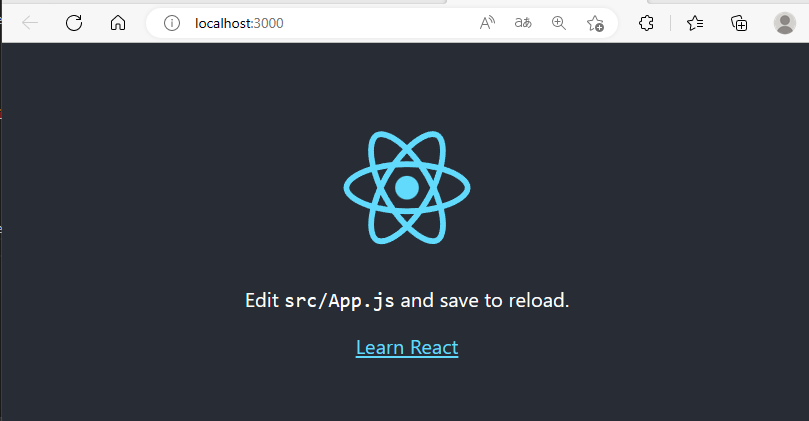
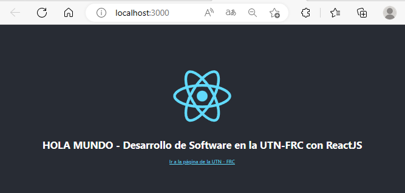
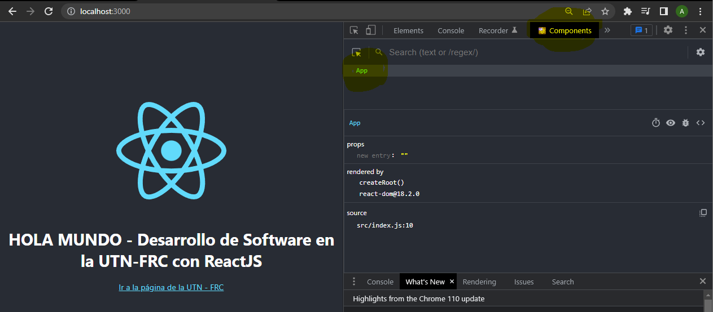
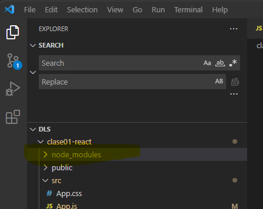
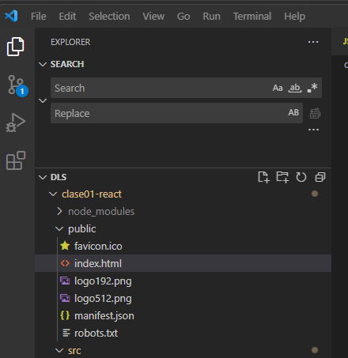

# Ejercicio Hola Mundo React

Crear un proyecto en react, y modificar el componente principal app, para que visualice el mensaje "HOLA MUNDO - Desarrollo de Software en la UTN-FRC con ReactJS"

En este ejercicio vamos a crear la primera aplicación de React.

1. Crear una carpeta para el proyecto con el explorador de archivos. Por ejemplo: c:\DLS
2. En Visual Studio Code desde el Menu "Archivo"=> "Abrir Carpeta" y seleccionar C:\DLS
3. En Visual Studio Code Seleccionar el menú "Terminal" => "Nueva Terminal" y seleccionar en la ventana de terminar "GIT Bash":

  
  
4. Ejecutar el comando **npx create-react-app ejercicio-react-holamundo**

  

   de esta forma se crea un proyecto llamado ejercicio-react-holamundo y se insalan los paquetes necesarios de react, librerias react-dom, react-scrips
5. Ejecutar los comandos dentro de la ventana de TERMINAL:

    ```shell
    cd ejercicio-react-holamundo
    npm start
    ```

    > Note que con el comando npm start el proyecto se inicia según la configuración existente en el archivo package.json
    Es decir el comando nmp start va a ejectuar el script de react react-scripts start

6. Verificar que el navegador visualice en la url <http://localhost:3000> la siguiente página

  

  Si puede visualizar dicha imagen significa que react se está ejecutando correctamente en su entorno de desarrollo.

7. Modifique el archivo src/App.js que es el achivo inicial de ejecución de React, para que muestre en un elemento de título de HTML "HOLA MUNDO - Desarrollo de Software en la UTN-FRC con ReactJS"  y permita con un enlace a "Ir a la página de la UTN - FRC" tal como se visualiza en la imagen siguiente:

    

    Este es un componente funcional (Functional component) de React. Tenga en cuenta que un componente en react se define como **function NombreComponente()** y si el componente recibe parámetros se define como **function NombreComponente(props)**  El código fuente sería:

    ```javascript
    import logo from './logo.svg';
    import './App.css';

    function App() {
      return (
        <div className="App">
          <header className="App-header">
            
            <h1>HOLA MUNDO - Desarrollo de Software en la UTN-FRC con ReactJS</h1>
              <a
              className="App-link"
              href="https://frc.utn.edu.ar"
              target="_blank"
              rel="noopener noreferrer"
            >
              Ir a la página de la UTN - FRC
            </a>
          </header>
        </div>
      );
    }

    export default App;
    ```

8. Verifique que el archivo *index.js* contiene el componente principal de react que se ejecutar. En este caso el componente es App, y el método de la librería de React con que se va a renderizar el componente se denomina *render*.

    ```javascript
    import React from 'react';
    import ReactDOM from 'react-dom/client';
    import './index.css';
    import App from './App';
    import reportWebVitals from './reportWebVitals';

    const root = ReactDOM.createRoot(document.getElementById('root'));
    root.render(
      <React.StrictMode>
        <App />
      </React.StrictMode>
    );

    // If you want to start measuring performance in your app, pass a function
    // to log results (for example: reportWebVitals(console.log))
    // or send to an analytics endpoint. Learn more: https://bit.ly/CRA-vitals
    reportWebVitals();

    ```

9. Verificar con el navegador Chrome o Mozilla Firefox con la extensión de **ES7 + React/Redux/ ReactNative**, que al presionar **F12** (ingresar entorno de desarrollo) vamos a ver que tenemos la opción **Components**, y tenemos el componente funcional **App**.



10. Observar que en la estructura de directorio esta la carpeta node_modules, esta carpeta contiene todos los paquetes que utiliza react, y dependencias del proyecto especificado en el archivo **package.json** y que podemos ir agregando al proyecto. Generalmente no se modifica manualmente ningún archivo dentro del mismo.

    

    Existe tambien la carpeta public que es de donde levanta el navegador el archivo

    

    favicon.ico: Icono de la pestaña del navegador
    **index.html**: archivo inicial princial del sitio
    **index.css**: archivo de hoja de estilo principal del proyecto
    **index.js**: archivo javascripto definido como  punto de entrada o de inicio principal donde se carga el framework de react y se indica cual es el componente principal, en nuestro caso el componente *App* y en qué etiqueta del HTML se va a cargar todo el componente y la aplicación de React

    ```javascript
    import React from 'react';
    import ReactDOM from 'react-dom/client';
    import './index.css';
    import App from './App';
    import reportWebVitals from './reportWebVitals';

    const root = ReactDOM.createRoot(document.getElementById('root'));
    root.render(
      <React.StrictMode>
        <App />
      </React.StrictMode>
    );

    // If you want to start measuring performance in your app, pass a function
    // to log results (for example: reportWebVitals(console.log))
    // or send to an analytics endpoint. Learn more: https://bit.ly/CRA-vitals
    reportWebVitals();

    ```

    Tener en cuenta que la aplicacion se va a cargar dentro del siguietne elemento html div con id="root" en la llamada **const root = ReactDOM.createRoot(document.getElementById('root'));**

    ```html
      <body>
        <noscript>You need to enable JavaScript to run this app.</noscript>
        <div id="root"></div>
        <!--
          This HTML file is a template.
          If you open it directly in the browser, you will see an empty page.

          You can add webfonts, meta tags, or analytics to this file.
          The build step will place the bundled scripts into the <body> tag.

          To begin the development, run `npm start` or `yarn start`.
          To create a production bundle, use `npm run build` or `yarn build`.
        -->
      </body>
    ```

    **logo.svg**: Logo de react en formato vectorial.
    **reportWebVital.js**: permite medir la perfomance de la aplicación.
    **setupTest.js**: archivo de configuración de tests y pruebas.
    **.gitignore**: permite configurar las exclusiones cuando se realiza un commit a un repositorio git.
    **package-lock.json**: archivo que se genera automaticamente cuando con npm se modifica el árbol node_modules o el archivo package.json.
    **package.json**: contien metadatos descriptivos acerca del proyecto, versión, dependencias. Provee al administrador de paquetes npm de la información para identificar el proyecto y manejar dependencias.
    **logo192.png**: logo de 192 pixeles que se utiliza cuando se crea un acceso directo a la aplicación segun se especifica en el archivo **manifest.json**.
    **logo512.png**: idem anterior, logo de 512 pixeles.
    **manifest.json**: archivo para configurar la aplicacion del tipo WPA (web progressive application) cuando se instala la app, en un dispositivo móvil, tablet.

    ```javascript
    {
      "short_name": "React App",
      "name": "Create React App Sample",
      "icons": [
        {
          "src": "favicon.ico",
          "sizes": "64x64 32x32 24x24 16x16",
          "type": "image/x-icon"
        },
        {
          "src": "logo192.png",
          "type": "image/png",
          "sizes": "192x192"
        },
        {
          "src": "logo512.png",
          "type": "image/png",
          "sizes": "512x512"
        }
      ],
      "start_url": ".",
      "display": "standalone",
      "theme_color": "#000000",
      "background_color": "#ffffff"
    }
    ```

    Vamos a trabajar habitualmente en la carpeta **src**.

11. Agregue un nuevo componente llamado HolaMundo.js que reciba un parametro por props que sea el mensaje a visualezar. Establecer dentro del componente HolaMundo que renderice el parámetro recibido como un elemento h1 de html. El valor incial del parámetro debe ser: "HOLA MUNDO - Desarrollo de Software en la UTN-FRC con ReactJS"

12. Cree un componente llamado HolaMundo.js que recibe un mensaje por props y lo muestra como un elemento h1

    ```javascript
    import React from 'react';

    function HolaMundo(props) {
      return (
        <h1>{props.mensaje}</h1>
      );
    }

    HolaMundo.defaultProps = {
      mensaje: 'HOLA MUNDO - Desarrollo de Software en la UTN-FRC con ReactJS'
    }

    export default HolaMundo;
    ```

    En este componente, la función HolaMundo recibe un objeto props como argumento, y dentro del return, se muestra el valor de la propiedad mensaje que se recibió por props como un elemento h1 de HTML.

    Además, se establece un valor por defecto para el prop mensaje utilizando defaultProps. Si el componente es utilizado sin proporcionar un valor para el prop mensaje, se utilizará el valor "HOLA MUNDO - Desarrollo de Software en la UTN-FRC con ReactJS" como valor por defecto.

13. Para utilizar este componente en otra parte de la aplicación, se puede importar el componente y utilizarlo como cualquier otro componente de React, pasándole el mensaje como valor de la propiedad *mensaje*. Modifique el componente App.js:

    ```javascript
    import logo from './logo.svg';
    import './App.css';
    import HolaMundo from './HolaMundo';

    function App() {

      return (
        <div>
          <HolaMundo mensaje='¡Hola mundo desde REACT! con props!'></HolaMundo>
        </div>
      );  
    }

    export default App;

    ```

    En este ejemplo, el componente HolaMundo se utiliza dentro del componente App, y se le pasa el mensaje "¡Hola mundo desde HolaMundo.js!" como valor de la propiedad mensaje. Si no se hubiera proporcionado un valor para mensaje, se habría utilizado el valor por defecto "HOLA MUNDO - Desarrollo de Software en la UTN-FRC con ReactJS".

14. Verifique el funcionamiento del componente sin la propiedad *mensaje*

    ```javascript
    import logo from './logo.svg';
    import './App.css';
    import HolaMundo from './HolaMundo';

    function App() {

      return (
        <div>
          <HolaMundo mensaje='¡Hola mundo desde REACT! con props!'></HolaMundo>
        </div>
      );  
    }

    export default App;
    ```
